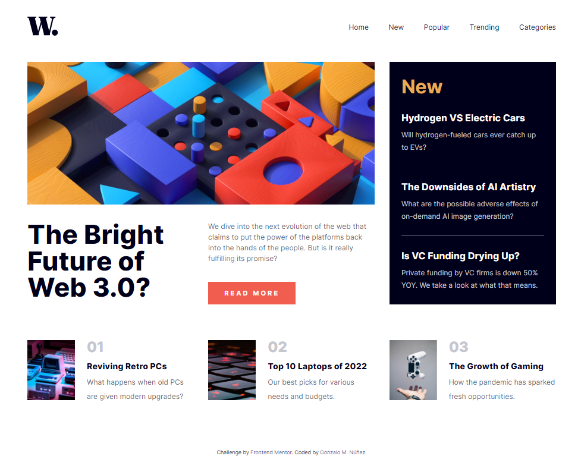
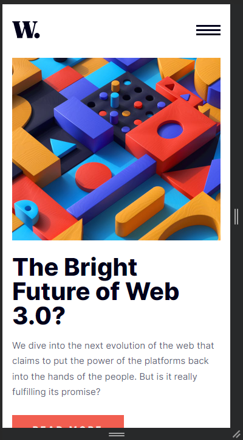
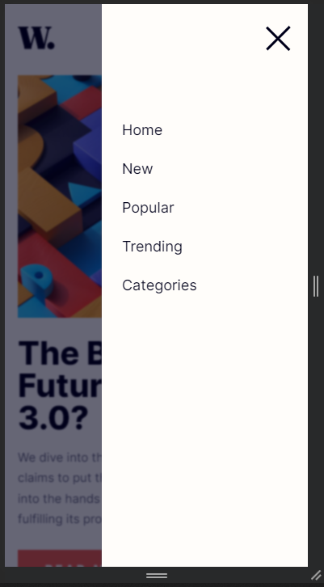
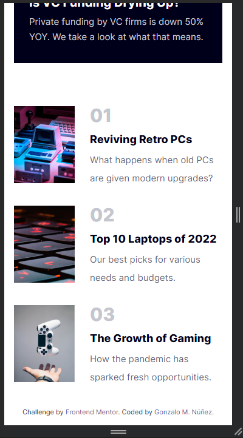

# Frontend Mentor - News homepage solution

This is a solution to the [News homepage challenge on Frontend Mentor](https://www.frontendmentor.io/challenges/news-homepage-H6SWTa1MFl). Frontend Mentor challenges help you improve your coding skills by building realistic projects. 

## Table of contents

- [Overview](#overview)
  - [The challenge](#the-challenge)
  - [Screenshots](#screenshots)
  - [Links](#links)
- [My process](#my-process)
  - [Built with](#built-with)
  - [What I learned](#what-i-learned)
  - [Useful resources](#useful-resources)
- [Author](#author)

**Note: Delete this note and update the table of contents based on what sections you keep.**

## Overview

This news homepage will be an excellent opportunity to practice your CSS Grid skills. There will be lots of tricky decisions to make and plenty of learning opportunities!

### The challenge

Users should be able to:

- View the optimal layout for the interface depending on their device's screen size
- See hover and focus states for all interactive elements on the page

### Screenshots

### Links

- Solution URL: [Find Solution here](https://github.com/gnunez0101/news-homepage)
- Live Site URL: [Find live site URL here](https://gnunez0101.github.io/news-homepage/)

## My process

My process began making all layout with HTML, then, working from top to bottom with styling for mobile layout. Next, I styled the desktop version, and finally, but not least important, I solved the mobile side menu with the hamburguer toggle. I used CSS Grid all the times even if some parts where easier to work with Flexbox. Tha idea was to practice Grid a lot.

### Built with

- Semantic HTML5 markup
- CSS custom properties
- CSS Grid
- Mobile-first workflow
- [React](https://reactjs.org/) - JS library
- [PicPick](https://picpick.app/en/) - Very useful tools for web development tasks, like measuring of pixels with a useful ruler for images and a very nice color picker.
- VS Code editor

### What I learned

I practiced a lot of CSS Grid laying out and styling with @media queries for mobile first and then for desktop. This was also a good practice for a React JS simple scripting project.

### Useful resources

- [PicPick](https://picpick.app/en/) - Very useful tools for web development tasks, like measuring of pixels with a useful ruler for images and a very nice color picker.

## Author

- LinkedIn - [Gonzalo Manuel Núñez](https://www.linkedin.com/in/gnunez0101)
- Frontend Mentor - [@gnunez0101](https://www.frontendmentor.io/profile/gnunez0101)